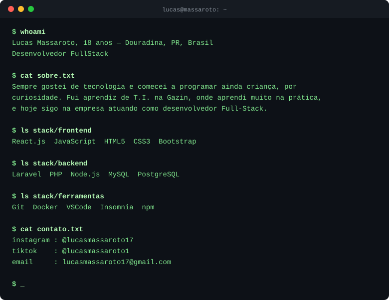

<div align="center">
  
</div>

<!-- <div align="center">

<h1><code>lucas@massaroto</code> <span style="color:#6EC6F0">~</span></h1>

</div>

```

$ whoami
Lucas Massaroto, 18 anos — Douradina, PR, Brasil
Desenvolvedor FullStack

$ cat sobre.txt
Sempre gostei de tecnologia e comecei a programar ainda criança, por
curiosidade. Fui aprendiz de T.I. na Gazin, onde aprendi muito na prática,
e hoje sigo na empresa atuando como desenvolvedor Full-Stack.

$ ls stack/frontend
React.js  JavaScript  HTML5  CSS3  Bootstrap

$ ls stack/backend
Laravel  PHP  Node.js  MySQL  PostgreSQL

$ ls stack/ferramentas
Git  Docker  VSCode  Insomnia  npm

$ cat contato.txt
instagram : @lucasmassaroto17
tiktok    : @lucasmassaroto1
email     : lucasmassaroto17@gmail.com

``` -->